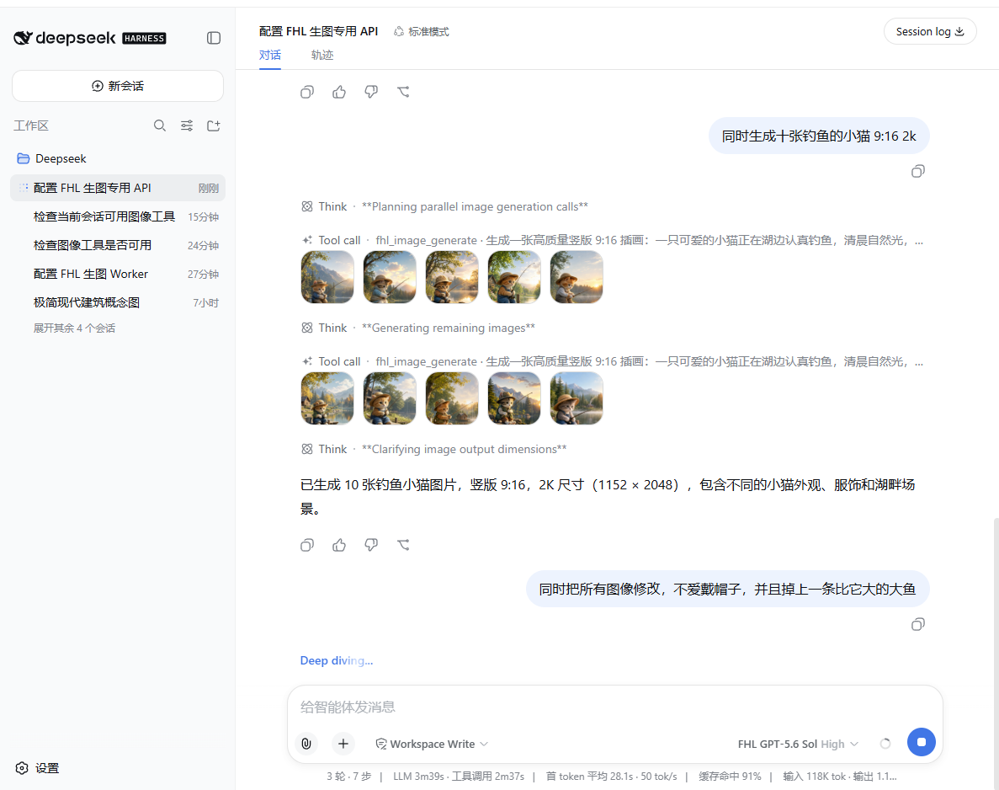
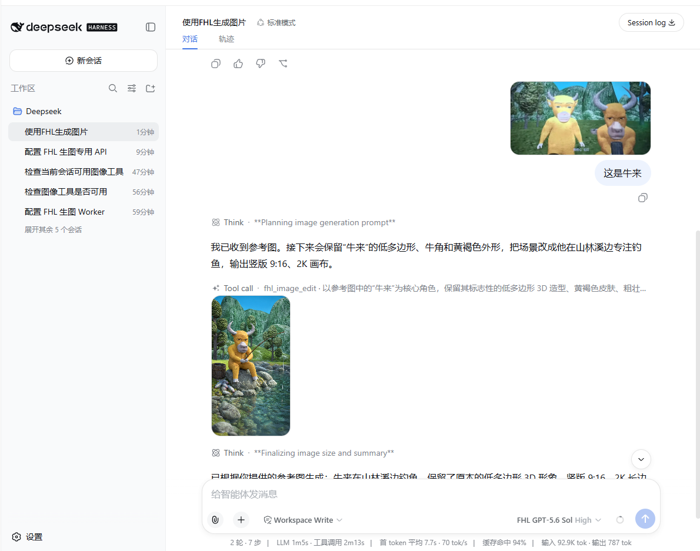

# DSH FHL Image 0.2.1

[中文](#fhl-zh) · [English](#fhl-en)

<a id="fhl-zh"></a>

## 中文

### 这是什么

`DSH FHL Image` 是一个独立、MIT 许可的 DeepSeek Harness 社区插件，为 DSH
增加 FHL Images 生图、图片编辑、多参考图和 Worker 池能力。

> 这是社区项目，不是官方 DeepSeek 或 FHL 产品，也不是完整的 DSH 软件。
> 使用前必须先安装并能启动 DSH。

### 版本对应

| 插件版本 | 目标 DSH | 状态 |
| --- | --- | --- |
| `0.2.1` | 官方桌面版 `0.2.0-rc.2` 包线 | 当前版本 |
| `0.1.0` | 旧 `0.1.1-rc.1` 包线 | 已不再支持 |

安装包：`fhl-plugins-dsh-fhl-image-0.2.1.tgz`（Release 附件，或本地
`pnpm build && pnpm pack` 生成）。`.tgz` 是插件包，**不能双击运行**。

下载直链：

```text
https://github.com/supart/DSH-FHL-Image-Plugin/releases/download/v0.2.1/fhl-plugins-dsh-fhl-image-0.2.1.tgz
```

### 安装

**一条提示词安装（推荐）**

在自己的 DSH 会话里直接发送下面这段，Agent 会用插件管理工具下载安装：

```text
请用插件管理工具安装这个 FHL 图像插件包：
https://github.com/supart/DSH-FHL-Image-Plugin/releases/download/v0.2.1/fhl-plugins-dsh-fhl-image-0.2.1.tgz

安装完成后打开它的启用开关，然后让我完全退出并重新打开 App。
之后新建会话，确认工具列表里有 fhl_image_configure、fhl_image_generate、fhl_image_edit。
```

> ⚠️ **必须用上面这条以 `.tgz` 结尾的下载直链。**
> 实测插件管理器只把「以 `.tgz` 结尾的 http(s) 直链」「本地绝对路径」「git 源」
> 「npm 包名」当作可安装来源，而本项目后三种都不可用：
> 仓库地址或 `.../releases/latest` 会被识别成 **git 源**，但本仓库不含构建产物
> `lib/`（已被 `.gitignore` 排除）且没有安装期构建脚本，装上去 `main` 指向的文件
> 不存在，插件无法加载；`@fhl-plugins/dsh-fhl-image` 也未发布到 npm。

安装会改写 `desktop` profile 的 `package.json`、`pnpm-lock.yaml` 与
`node_modules/`，因此需要 `danger-full-access` 权限或当次授权。

**图形界面手动安装**

1. 把 tarball 放到**不含空格**的目录（如 `~/Downloads/`），进入侧边栏「插件」页面，
   选择安装并填入它的**绝对路径**。
2. 安装完成后打开该插件的启用开关。
3. 完全退出并重新打开 App。
4. 新建会话，确认工具列表中有 `fhl_image_configure`、`fhl_image_generate`、
   `fhl_image_edit`。

桌面 App 独占管理 `desktop` profile，因此不要从外部 shell 对它执行 `dsh plugin`。

**命令行版 DSH（进阶）**

```sh
dsh plugin --profile fhl-image add /绝对路径/fhl-plugins-dsh-fhl-image-0.2.1.tgz
dsh --profile fhl-image --dump-config
dsh --profile fhl-image
```

完整步骤、验证判据与升级卸载见 [安装说明](docs/INSTALL.zh-CN.md)。

### 已实现的工具

- `fhl_image_configure`：用户明确要求时配置最多十个 Worker。
- `fhl_image_generate`：生成一至九张图。
- `fhl_image_edit`：使用一至十张有序参考图进行编辑或组合。

### 聊天配置生图 API

新建会话，先确认工具列表中有上面三个工具，然后发送：

```text
我想配置 FHL 生图专用 API。请使用 fhl_image_configure 工具，并先告诉我需要如何提供一个或多个 Worker Key；不要调用生图工具。
```

Agent 询问后，把一个或多个 Worker Key 粘贴到聊天框，每个 Key 一行。配置阶段只应
调用 `fhl_image_configure`，成功后只根据脱敏的 Worker 数量确认配置。

聊天配置有一个重要边界：原始 Key 会随用户消息经过当前模型，并可能保留在 DSH 会话
历史中。不能接受这种传输方式的凭据，应改用 DSH 自身的凭据机制直接写入对应引用名
（`FHL_IMAGE_API_KEY`、`FHL_IMAGE_API_KEY_2`……）。插件配置项 `apiKeyEnv` 只是这些
引用名的前缀，**不是环境变量**。不要把 Key 发到 GitHub、Codex 主对话、截图、日志
或 Issue。

### 第一次生图和编辑

```text
请使用 FHL 生图工具生成一张极简现代建筑的全彩效果图，生成 1 张，比例 16:9，2K。
```

有参考图时，把图片拖入聊天框：

```text
请使用这张参考图进行编辑，保留主体特征，生成一张全彩效果图。
```

编辑时若省略 `sources`，插件会依次使用：当前用户消息里的图片 → 更早的用户上传
图片 → 本插件在同一会话、同一进程内生成的最近一张图。重启 App 后第三条记忆会
失效，此时请显式传入上一次结果中的 `attachmentId`。

结果通过 DSH 附件服务回到对话中。

### 覆盖插件配置

默认值写在 bundle 层里，不读取环境变量。需要修改时，在 profile 补丁层覆盖：

```yaml
# ~/.dsh/profiles/desktop/cordis.patch.yml
- id: fhl-image
  name: '@fhl-plugins/dsh-fhl-image'
  config:
    baseURL: https://www.fhl.mom
    timeoutMs: 180000
    workerCooldownMs: 60000
```

### GitHub 页面示例图

下面两张图来自本项目的实际使用界面：





### 没有工具怎么办

1. 确认插件在「插件」页面已安装且已启用。
2. 完全退出并重新打开桌面 App（命令行版则停止旧 Host 后重启同一个 profile）。
3. 新建会话，再检查三个工具。

旧进程可能仍然只暴露旧工具目录，修改插件或重新安装后必须重启。

如果安装报 `incompatible-version`，说明插件版本与当前 DSH 运行时不匹配：换用对应
版本的插件，而不是授予版本豁免。详见 [故障排查](docs/TROUBLESHOOTING.zh-CN.md)。

### 详细文档

- [第一次使用说明](README-FIRST.zh-CN.md)
- [安装说明（桌面 App 与命令行版）](docs/INSTALL.zh-CN.md)
- [聊天配置 API](docs/CONFIGURATION.zh-CN.md)
- [没有工具/安装失败排查](docs/TROUBLESHOOTING.zh-CN.md)
- [安全与凭据边界](docs/SECURITY.zh-CN.md)
- [源码开发者说明](docs/DEVELOPMENT.zh-CN.md)
- [0.2.1 发布说明](docs/RELEASE_NOTES.zh-CN.md)

### 许可证与上游关系

本项目使用 MIT 许可证，是独立社区分发，不是官方 DeepSeek 产品。上游 DSH 源码、
whitecodex、FHL Harness 项目、Android 项目、已安装桌面版和旧数据均保持在项目外，
本项目不会自动修改它们。

<a id="fhl-en"></a>

## English

[Back to 中文](#fhl-zh)

Independent MIT-licensed DeepSeek Harness community bundle for FHL Images.
It adds image generation, multi-reference editing, a bounded worker pool, and
an Agent tool that can configure image workers from keys the user supplies in
chat.

> This is an independent community plugin. It is not an official DeepSeek or
> FHL product. DeepSeek Harness is in developer preview and plugin APIs may
> change between releases.

## Version Compatibility

| Plugin | Target DSH | Status |
| --- | --- | --- |
| `0.2.1` | Official desktop line `0.2.0-rc.2` | Current |
| `0.1.0` | Legacy `0.1.1-rc.1` line | Unsupported |

DSH 0.2 checks every `@deepseek-ai/dsh*` peer range against the running runtime
before installing a bundle and again at startup, so the declared ranges — not
the plugin version alone — decide whether installation is accepted.

## Features

- `fhl_image_generate`: one to nine image variations through the FHL Images API.
- `fhl_image_edit`: one to ten ordered reference images, with one to four
  independent edit variations.
- Up to ten managed image workers addressed through the DSH credential provider
  as `FHL_IMAGE_API_KEY` through `FHL_IMAGE_API_KEY_10`.
- Retryable worker cooldown, per-worker authentication isolation, cancellation,
  bounded responses, and credential redaction.
- Durable DSH attachment output so generated images appear in the conversation.
- `fhl_image_configure`: configure one or more workers from a chat message.

## Install

Download link:

```text
https://github.com/supart/DSH-FHL-Image-Plugin/releases/download/v0.2.1/fhl-plugins-dsh-fhl-image-0.2.1.tgz
```

**One-prompt install (recommended).** Send this in your own DSH session:

```text
Install this FHL image plugin bundle with the plugin manager tool:
https://github.com/supart/DSH-FHL-Image-Plugin/releases/download/v0.2.1/fhl-plugins-dsh-fhl-image-0.2.1.tgz

Then switch it on and tell me to fully quit and reopen the application.
Afterwards, start a new session and confirm the tool list contains
fhl_image_configure, fhl_image_generate and fhl_image_edit.
```

> ⚠️ **Use the `.tgz` download link above.** The plugin manager accepts only a
> `.tgz`-suffixed http(s) URL, an absolute local path, a git source, or an npm
> package name — and for this project only the first two work. A repository URL
> or `.../releases/latest` is parsed as a **git** source, but this repository
> ships no build output (`lib/` is gitignored) and declares no install-time build
> script, so `main` would point at a file that does not exist. The package is
> also not published to npm.

The install rewrites the `desktop` profile's `package.json`, `pnpm-lock.yaml`
and `node_modules/`, so it needs `danger-full-access` or a per-action approval.

**Manual install via the GUI.** Open the Plugins page in the sidebar, install the
`.tgz` by absolute path, switch the plugin on, fully quit and reopen the
application, then start a new session and confirm the three tools. The desktop
application owns its `desktop` profile, so do not run `dsh plugin` against it
from an external shell.

**CLI profiles.**

```sh
dsh plugin --profile fhl-image add /absolute/path/fhl-plugins-dsh-fhl-image-0.2.1.tgz
dsh --profile fhl-image --dump-config
dsh --profile fhl-image
```

See [the install guide](docs/INSTALL.zh-CN.md) for verification criteria,
upgrades, and removal.

## Chat Configuration

```text
I want to configure FHL image workers. Use fhl_image_configure first; do not call image tools.
```

For multiple workers, send one key per line. The Agent calls
`fhl_image_configure`, which stores the keys through the DSH credential provider
and returns only a masked worker count.

This mode is intentionally chat-based, so the original key is part of the user
message sent to the selected model and may be retained in the DSH session
history. A key that must never reach the model provider should be written into
the credential store directly under the reference name
(`FHL_IMAGE_API_KEY`, `FHL_IMAGE_API_KEY_2`, …). The `apiKeyEnv` config value is
only the prefix of those reference names; it is **not** an environment variable.
The plugin never includes key values in tool results, image artifacts, normal
diagnostics, or its own error messages.

## Edit Sources

`fhl_image_edit` without `sources` resolves references in this order: an image
in the current user message, then the latest earlier user upload, then the
newest image this plugin produced earlier in the same session. The last one is
an in-memory, per-session cache and does not survive an application restart;
pass the `attachmentId` from a previous result explicitly in that case.

## Real Usage Examples


## Development

Requirements: Node.js `>=22.19.0`, pnpm 11, and the DSH `0.2.0-rc.2` package
line (the official desktop application ships it).

```sh
pnpm install --ignore-scripts
pnpm typecheck
pnpm test
pnpm build
pnpm pack:check
```

All tests use local mocks. They do not call FHL or another paid service. The
package has no install-time build script, so the published `.tgz` never requires
a build authorization.

## API Defaults

- Base URL: `https://www.fhl.mom`
- Image model: `gpt-image-2`
- Generation route: `/v1/images/generations`
- Edit route: `/v1/images/edits`
- Output: PNG `b64_json`
- Default quality policy: tested 2K matrix; 4K must be an explicit tool request

The DSH Agent chooses the tool. The plugin does not call the image API on
startup and does not retry a completed successful image request.

## Scope And Limitations

- This is a Host/Cordis bundle and does not ship a custom DSH settings-card UI;
  per-profile configuration goes through a patch layer.
- API key configuration is model-mediated chat configuration, or a direct write
  into the DSH credential store.
- The plugin does not download or execute arbitrary remote plugins.

## License

MIT. See [LICENSE](LICENSE).
